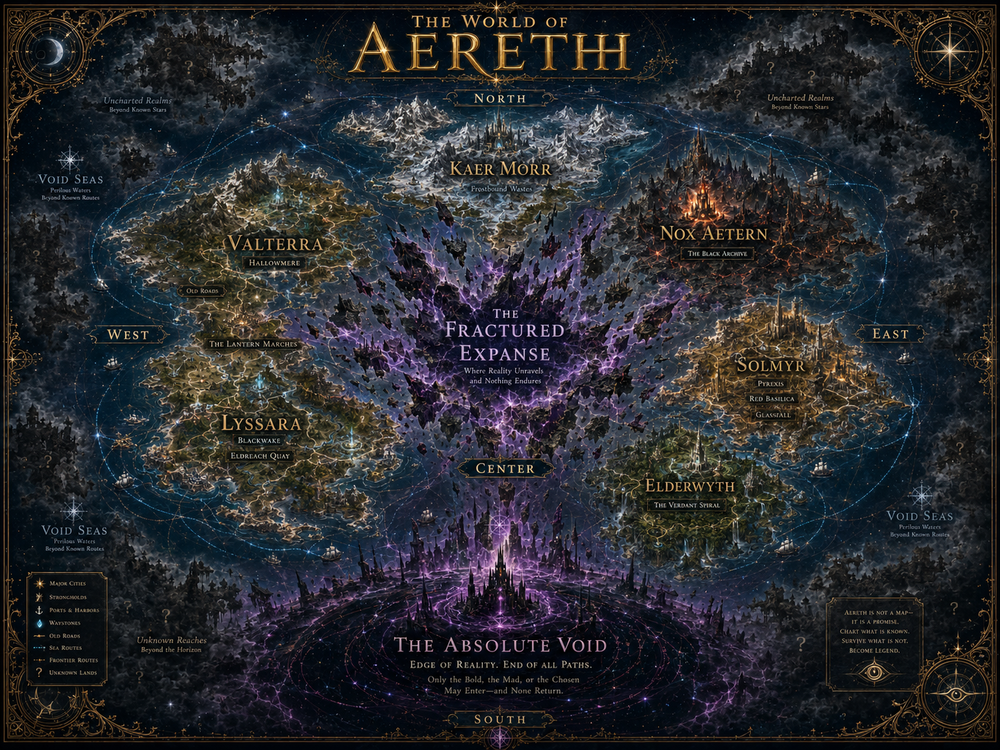

# Detailed World Atlas Map

## Purpose

The Detailed World Atlas Map focuses on the six known continents and their relationships. It introduces more named locations while preserving the broader mystery of Aereth.

This is the main **known-world atlas** reference.

## Canon Shown

Continents:

- Valterra
- Lyssara
- Kaer Morr
- Nox Aetern
- Solmyr
- Elderwyth

Major features:

- The Fractured Expanse
- Void Seas
- The Absolute Void

Named locations:

- The Lantern Marches
- Hallowmere
- Blackwake
- Eldreach Quay
- Pyrexis
- Red Basilica
- Glassfall
- The Black Archive
- The Verdant Spiral
- Hollow Scar
- Old Roads

## The Lantern Marches

The Lantern Marches should appear as a **starter-region corridor** between Valterra and Lyssara influence, not as a continent. It represents broken roads, frontier posts, early archives, low-risk Fragment disturbance, and outward routes into the wider West.

## Readable World Relationships

- Valterra and Lyssara define the western starting world.
- Kaer Morr sits north as the survival frontier.
- Nox Aetern and Solmyr dominate eastern advanced regions.
- Elderwyth lies on the east-south frontier, culturally older and stranger.
- The Fractured Expanse interrupts and distorts the middle of the world.
- The Absolute Void marks finality to the south.

## Usage

Use this map for:

- World atlas pages.
- Continent pages.
- Public lore/wikis.
- Builder references.
- Story planning.

Do not treat generated micro-labels as canon unless they appear in approved notes.
