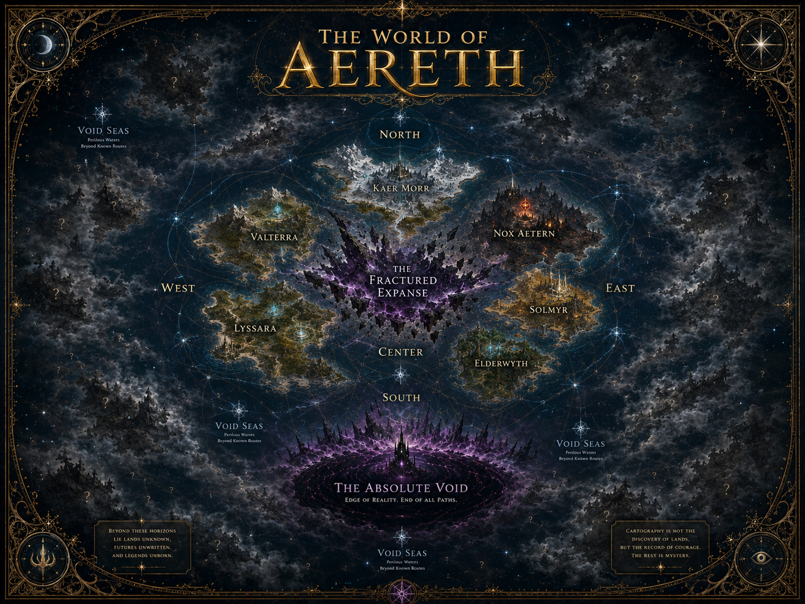

# Macro World Map

## Purpose

The Macro World Map is the broadest visual overview of Aereth. It establishes that the known world is only part of a larger world, with major fogbound landmasses and unexplored territories surrounding the six known continents.

This map is about **scale**, **mystery**, and **mythic orientation**, not settlement-level precision.

## Canon Shown

The map should preserve:

- Aereth as the world/server/setting.
- The five macro-divisions: West, North, East, Center, South.
- The six known continents:
  - Valterra
  - Lyssara
  - Kaer Morr
  - Nox Aetern
  - Solmyr
  - Elderwyth
- The Fractured Expanse as the dominant central scar.
- The Void Seas as dangerous outer routes.
- The Absolute Void in the far South.
- Fogbound future lands in multiple directions.

## Symbolic vs Literal

Literal:

- General continental placement.
- The centrality of the Fractured Expanse.
- The South as void-endgame/finality.
- The West as the known beginning.

Symbolic:

- Exact coastline shapes.
- Exact distances.
- The size of fogbound continents.
- Decorative celestial geometry.
- Tiny unreadable annotations.

## Usage

Use this map for:

- Website hero/world overview.
- Public wiki world introduction.
- Pitch deck/worldbuilding overview.
- High-level lore orientation.

Do not use this map alone for:

- Quest routing.
- Region level design.
- Settlement coordinates.
- Dungeon placement.
