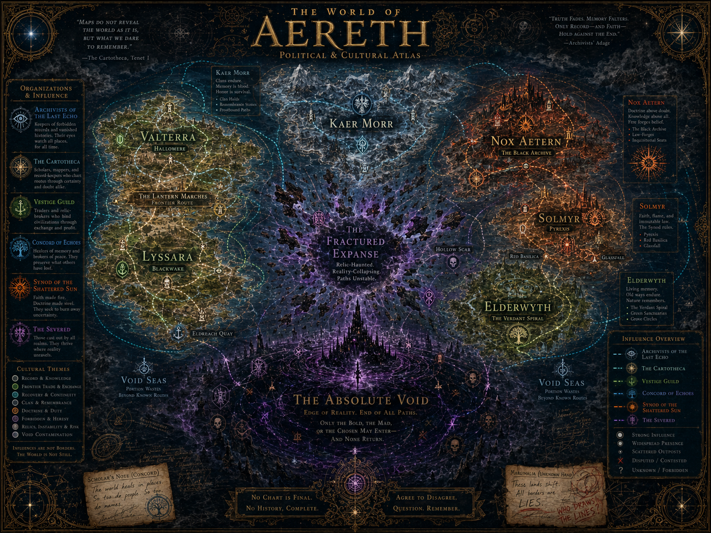

# Political Cultural Atlas Map

## Purpose

The Political & Cultural Atlas Map shows influence, faction presence, cultural memory, and disagreement over the known world.

It must not look like a modern nation-state border map. Aereth factions are not simple countries. They are responses to loss.

## Canon Principle

Influences are not borders. The world is not still.

## Major Organizations

### Archivists of the Last Echo

Associated with:

- records
- vanished histories
- forbidden memory
- registry culture
- post-RE:FRAGMENT continuity

Likely influence:

- western records
- archives
- contested knowledge sites
- some eastern archive-adjacent zones

### The Cartotheca

Associated with:

- maps
- routes
- navigation
- disputed geography
- cartographic truth and lies

Likely influence:

- routes across the known world
- Void Sea navigation
- fogbound margins
- political/cartographic disputes

### Vestige Guild

Associated with:

- relic trade
- frontier exchange
- recovery economies
- risk brokerage

Likely influence:

- West
- ports
- frontier roads
- trade corridors
- relic routes near unstable zones

### Concord of Echoes

Associated with:

- memory repair
- peace-brokering
- continuity
- cultural recovery
- remembrance practices

Likely influence:

- West
- North memory zones
- Lyssara/Valterra recovery culture
- places where memory damage affects communities

### Synod of the Shattered Sun

Associated with:

- doctrine
- fire
- law
- certainty
- belief forged into power

Likely influence:

- Solmyr
- Pyrexis
- Red Basilica
- eastern doctrinal regions

### The Severed

Associated with:

- exile
- fracture pressure
- instability
- reality-collapse zones
- dangerous anti-continuity culture

Likely influence:

- Fractured Expanse edges
- Hollow Scar
- unstable routes
- scattered outposts
- voidbound or forbidden areas

## Cultural Blocs

### West

Record-keeping, frontier trade, recovery culture, routes, registries, and continuity.

### North

Clan survival, remembrance, cold endurance, grave-memory, and harsh inherited duty.

### East

Doctrine, forbidden knowledge, archives, fire-forged belief, and dangerous certainty.

### Center

Relic danger, instability, reality collapse, and fractured truth.

### South

Void contamination, finality, terror, and endgame metaphysics.

## Redaction Rule

This map should preserve uncertainty. Fogbound areas may be:

- unlabeled
- crossed out
- partially erased
- disputed
- annotated by rival factions
- marked unknown/forbidden

Redactions are worldbuilding, not mistakes.

## Usage

Use this map for:

- faction pages
- political/cultural lore
- wiki/worldbuilding centerpiece
- region culture design
- story conflict planning

Do not use it to define exact sovereign borders.
