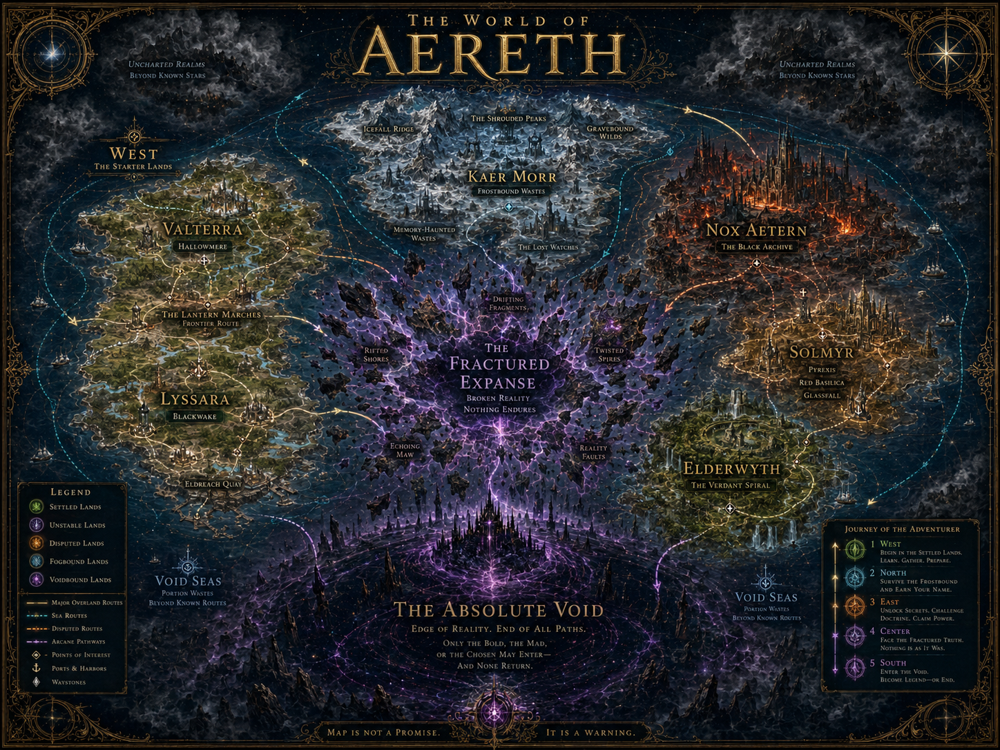

# Regional Progression Map

## Purpose

The Regional Progression Map explains the player journey through Aereth. It is not a straight corridor. It is a readable flow of escalating danger, knowledge, instability, and metaphysical consequence.

## Progression Flow

Primary progression direction:

1. West
2. North
3. East
4. Center
5. South

## Regional Meaning

### West

The beginning. Settled enough to survive. Broken enough to matter.

Themes:

- starter lands
- records and recovery
- trade routes
- frontier movement
- early Fragment disturbance

Key locations:

- The Lantern Marches
- Hallowmere
- Blackwake
- Eldreach Quay
- Old Roads

### North

The survival frontier.

Themes:

- harsh ridges
- clan endurance
- remembrance culture
- grave-like landscapes
- memory-haunted wilderness

Key continent:

- Kaer Morr

### East

Advanced regions of doctrine and dangerous knowledge.

Themes:

- forbidden archives
- doctrinal power
- fire-forged belief
- mutation theories
- higher-risk knowledge economies

Key locations:

- Nox Aetern
- Solmyr
- Pyrexis
- Red Basilica
- Glassfall
- The Black Archive

### Center

The reality-wounded endgame threshold.

Themes:

- unstable terrain
- relic danger
- floating fragments
- broken causality
- high-pressure Fragment consequences

Key region:

- The Fractured Expanse
- Hollow Scar

### South

Void-endgame and finality.

Themes:

- Void Seas
- voidbound contamination
- terminal geography
- Absolute Void
- endgame terror

Key feature:

- The Absolute Void

## World-State Categories

The legend defines:

- Settled Lands
- Unstable Lands
- Disputed Lands
- Fogbound Lands
- Voidbound Lands

These categories are gameplay-useful but still lore-first.

## Usage

Use this map for:

- player onboarding
- world progression pages
- quest arc planning
- level-range discussions
- route/region design

This map can support gameplay communication, but level numbers must be defined in separate progression design docs.
